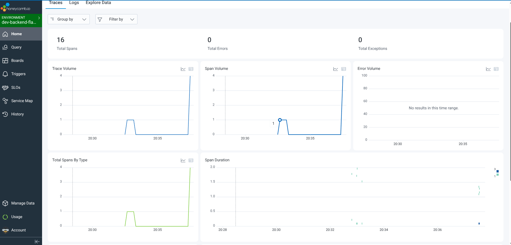
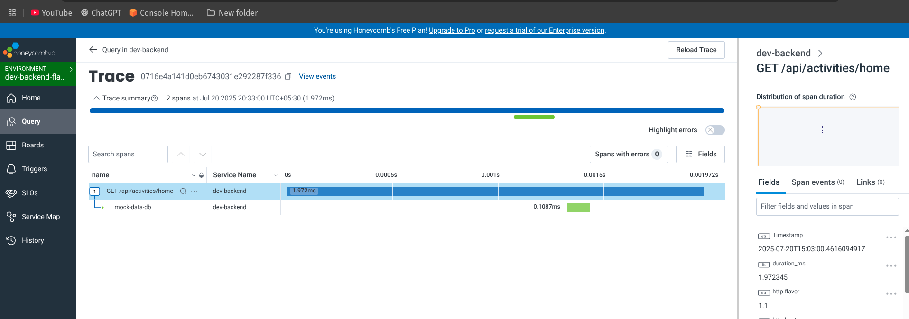
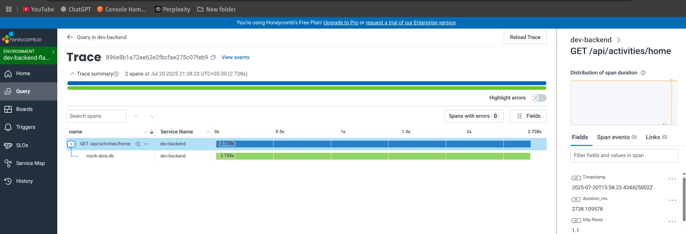
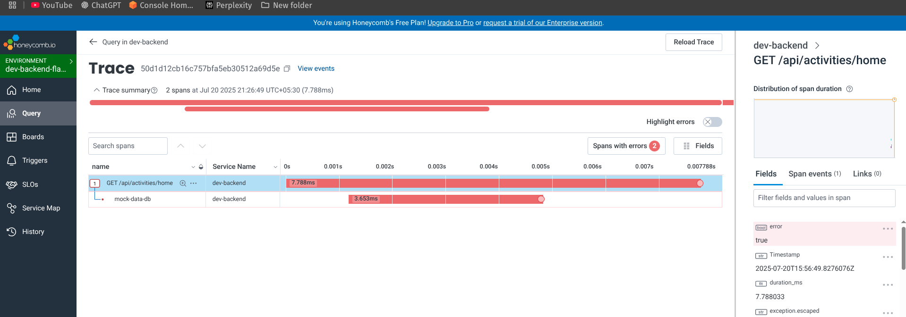

# Scope of Observability Project

The scope of this project is to learn the Obserability skills by configuring Honeycomb with a Python Flask backend.

In this project I will documents the process invloved in configuring Honeycomb.

## What is Observability?

As we know for programming languages we have debuggers, which helps us to find the errors in the program syntax, logic etc.
Similarly for large software systems we need some means to capture what's going on in this system. To capture the overall health of the software system we make use of observability.

Observability is the ability to understand the internal state of a system based on the data through logs, metrics, and traces. It helps to debug, monitor, and optimize systems in distributed and microservices environments.


## Why you should configure observability in your applications?

Observability helps you understand what’s happening inside your application when it’s running in real-world environments. When users experience slow responses, errors, or unexpected behavior, observability tools can show you exactly where the problem is such as a slow database query, failed API call, or spike in traffic.

By configuring observability, you gain real-time visibility into your application's health and performance, which helps you detect issues faster.


## Observability Terms

While instrumenting any observability tool, we come across the following terms quite often. Let's understand the definition of each term.

Traces: It represents the journey of a single request through various components, such as microservices, within a distributed system. Traces can be thought of as a detailed timeline of what happens behind the scenes when a user clicks a button or an API is called.

Span: Each part of this story is told by a span. A span is a single piece of instrumentation from a single location in your code. It represents a single unit of work done by a service.

Instrumentation: It is the code that send data to make the trace.


## Honeycomb

Honeycomb.io is a cloud-native observability platform designed to debug and understand distributed systems

Under the hoods, Honeycomb uses OpenTelemetry (OTel) observability framework that generats, collects, and exports trace data. The following figure explains the simple architecture of Honeycomb.


## Adding Automatic Instrumentation in Honeycomb

Let's get started with instrumenting honeycomb.io with the backend-flask to collect traces automatically.

1. create an account in Honeycomb.io.
2. On the left navigation bar, click **Environment**>**Manage Environments**
3. Click **Create Environment** and enter the following information:
- Name (required) - Enter a name. I entered dev-backend-flask.
- Description - It's optional. Enter a description.
4. Click **Create Environment**.


Add the following environment variables in `.env`:
```
OTEL_EXPORTER_OTLP_ENDPOINT: "https://api.honeycomb.io"
OTEL_EXPORTER_OTLP_HEADERS: "x-honeycomb-team=your_api_key_here"
OTEL_SERVICE_NAME: "your_service_name_here"
```

Add the following packages to `requirements.txt` file:
```
opentelemetry-api 
opentelemetry-sdk 
opentelemetry-exporter-otlp-proto-http 
opentelemetry-instrumentation-flask 
opentelemetry-instrumentation-requests
```

then cd backend-flask/ and run:
```
$ pip install -r requirements.txt
```

In app.py, add the following packages:
```
from opentelemetry import trace
from opentelemetry.instrumentation.flask import FlaskInstrumentor
from opentelemetry.instrumentation.requests import RequestsInstrumentor
from opentelemetry.exporter.otlp.proto.http.trace_exporter import OTLPSpanExporter
from opentelemetry.sdk.trace import TracerProvider
from opentelemetry.sdk.trace.export import BatchSpanProcessor
```

In app.py, add tracing and an exporter that can send data to Honeycomb:
```
provider = TracerProvider()
processor = BatchSpanProcessor(OTLPSpanExporter())
provider.add_span_processor(processor)
trace.set_tracer_provider(provider)
tracer = trace.get_tracer(__name__)
```

In app.py, initialize automatic instrumentation with Flask:
```
app = Flask(__name__)
FlaskInstrumentor().instrument_app(app)
RequestsInstrumentor().instrument()
```

Refer to /backend-flask/app.py file on how the instrumentation code is added.


## Adding Custom Instrumentation in Honeycomb

Currently the app in the dev mode, the database is not yet connected. Instead a mock-up data is added in home_activities.py to simluate the home data. Let's do the custom instrumentation of home_activities.py to see how the DB connection traces are created.

Add the following package:
```
from opentelemetry import trace
```

Acquire a Tracer
```
tracer = trace.get_tracer("home.activity")

```

wrap function wth custom span:

```
with tracer.start_as_current_span("mock-data-db"):
```

Refer to /backend-flask/services/home_activites.py file on how the instrumentation code is added.

Run the following command to run the docker compose file:
```
sudo docker compose -f docker-compose.dev.yml up -d
```

Go to your browser and enter localhost:5000/api/activities/home and refersh multiple times to send the request.

Go to your Honeycomb.io and select the environment you created.

Hola! You can see the traces coming up on the Home screen.



Let's understand what each graph provides information:

Trace Volume: A trace helps visualize full user journeys or request lifecycles. A trace is a group of related spans representing a full request or transaction.

Span Volume: This is usually a line graph showing number of individual spans received over time. A span represents a single unit of work (like a function call, DB query, etc).

Span Duration: How long each span took to complete, usually in seconds or milliseconds.

The following figure shows the summary of Traces:



## Simulating Latency and HTTP 500 Error

Let's simulate the slowness and HTTP 500 internal server error to understand how Traces are formed:

set SIMULATE_HOME_LATENCY: "1" in `.env`.

```
class HomeActivities:
  def run():
    with tracer.start_as_current_span("mock-data-db") as span:
      # Simulate slow latency if env var is set
      if os.getenv("SIMULATE_HOME_LATENCY") == "1":
        delay = round(random.uniform(1, 3), 2)
        span.set_attribute("mock.latency", delay)
        print(f"[HomeActivities] Simulating latency: {delay}s")
        time.sleep(delay)
``` 

SIMULATE_HOME_ERROR: "1" in `.env`. 


```
      # Simulate error via env variable (useful in tests)
      if os.getenv("SIMULATE_HOME_ERROR") == "1":
        span.set_attribute("mock.error", True)
        raise Exception("Simulated error from HomeActivities")
```        

when you want to simulate latency, set:
```
SIMULATE_HOME_LATENCY: "1"
SIMULATE_HOME_ERROR: "0"
```

Latency Trace:


when you want to simulate HTTP 500 error, set:
```
SIMULATE_HOME_LATENCY: "0"
SIMULATE_HOME_ERROR: "1"
```

HTTP 500 error Trace:


