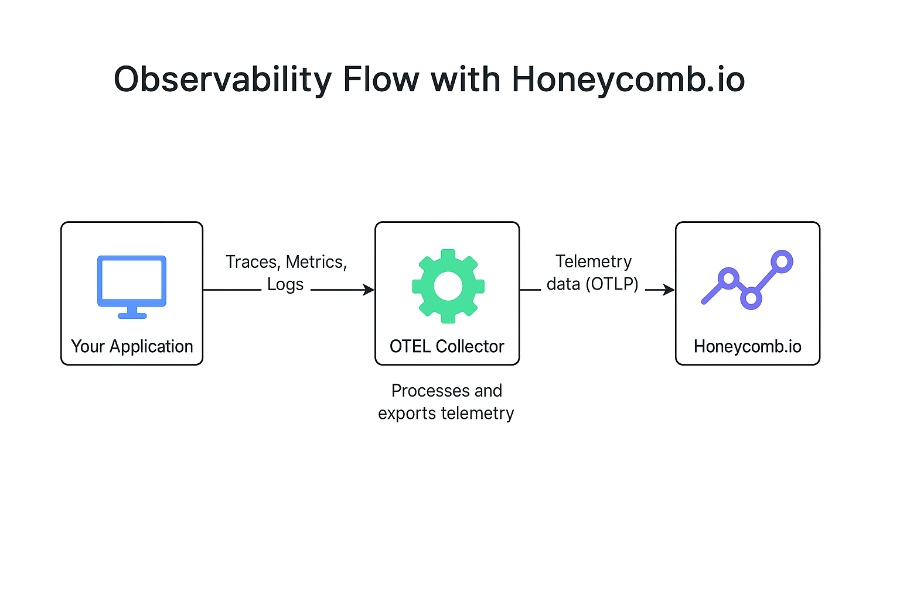

# Scope of Observability Project

The scope of this project is to learn the Obserability skills by configuring:

- Honeycomb
- Rollbar


In this project I will documents the process invloved in configuring Honeycomb and Rollbar.

## What is observability?

As we know for for programming languages we have debuggers, which helps us to find the errors in the program syntax, logic etc.
Similarly for large software systems we need some means to capture what's going on in this system. To capture the overall health of the software system we make use of observability.


## Why someone should configure observability in their applications?

## How it helps?

## Observability Terms

While instrumenting any observability tool, we come across the following terms quite often. Let's understand the definition of each term.

Traces: It represents the journey of a single request through various components, such as microservices, within a distributed system. Traces can be thought of as a detailed timeline of what happens behind the scenes when a user clicks a button or an API is called.

Span: Each part of this story is told by a span. A span is a single piece of instrumentation from a single location in your code. It represents a single unit of work done by a service.

Instrumentation: It is the code that send data to make the trace.


## Honeycomb

Under the hoods, Honeycomb uses OpenTelemetry (OTel) observability framework that generats, collects, and exports trace data. The following figure explains the simple architecture of Honeycomb.




## Adding Autoamtic Instrumentation in Honeycomb

Let's get started with instrumenting honeycomb.io with the backend-flask to collect traces automatically.

1. create an account in honeycomb.io.
2. On the left navigation bar, click **Environment**>**Manage Environments**
3. Click **Create Environment** and enter the following information:
- Name (required) - Enter a name. I entered dev-backend-flask.
- Description - It's optional. Enter a description.
4. Click **Create Environment**.


Add the following packages to `requirements.txt` file:
```
opentelemetry-api 
opentelemetry-sdk 
opentelemetry-exporter-otlp-proto-http 
opentelemetry-instrumentation-flask 
opentelemetry-instrumentation-requests
```

then cd backend-flask/ and run:
```
$ pip install -r requirements.txt
```

In app.py, add the following packages:
```
from opentelemetry import trace
from opentelemetry.instrumentation.flask import FlaskInstrumentor
from opentelemetry.instrumentation.requests import RequestsInstrumentor
from opentelemetry.exporter.otlp.proto.http.trace_exporter import OTLPSpanExporter
from opentelemetry.sdk.trace import TracerProvider
from opentelemetry.sdk.trace.export import BatchSpanProcessor
```

In app.py, add tracing and an exporter that can send data to Honeycomb:
```
provider = TracerProvider()
processor = BatchSpanProcessor(OTLPSpanExporter())
provider.add_span_processor(processor)
trace.set_tracer_provider(provider)
tracer = trace.get_tracer(__name__)
```

In app.py, initialize automatic instrumentation with Flask:
```
app = Flask(__name__)
FlaskInstrumentor().instrument_app(app)
RequestsInstrumentor().instrument()
```

Refer to /backend-flask/app.py file on how the instrumentation code is added.


## Adding Custom Instrumentation in Honeycomb

Currently the app in the dev mode, the database is not yet connected. Instead a mock-up data is added in home_activities.py to simluate the home data. Let's do the custom instrumentation of home_activities.py to see how the Db connection traces are created.

Add the following package:
```
from opentelemetry import trace
```

Acquire a Tracer
```
tracer = trace.get_tracer("home.activity")

```

wrap function wth custom span:

```
with tracer.start_as_current_span("mock-data-db"):
```

Refer to /backend-flask/services/home_activites.py file on how the instrumentation code is added.


